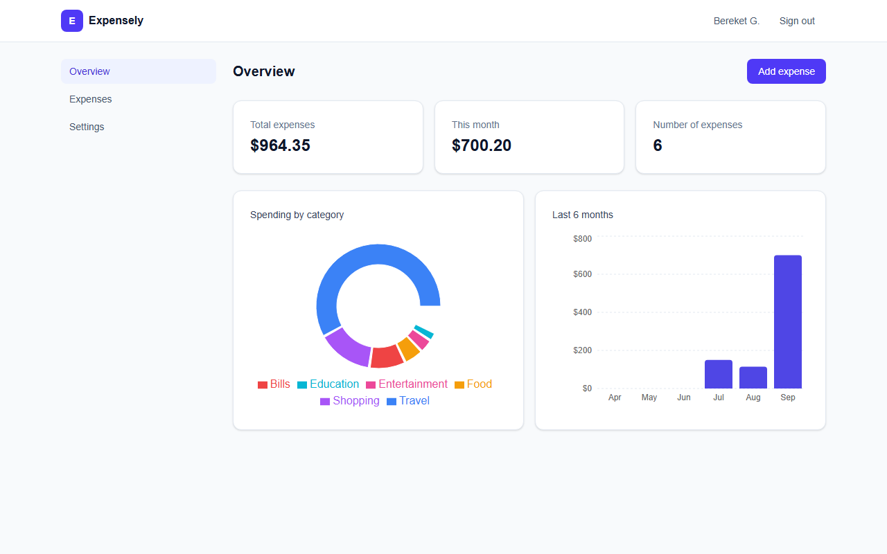
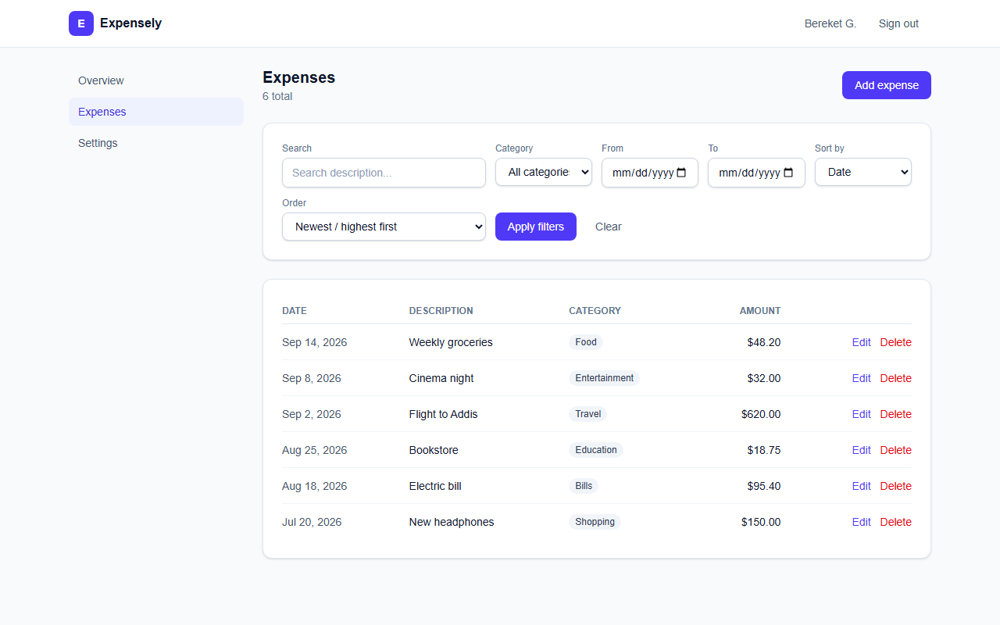
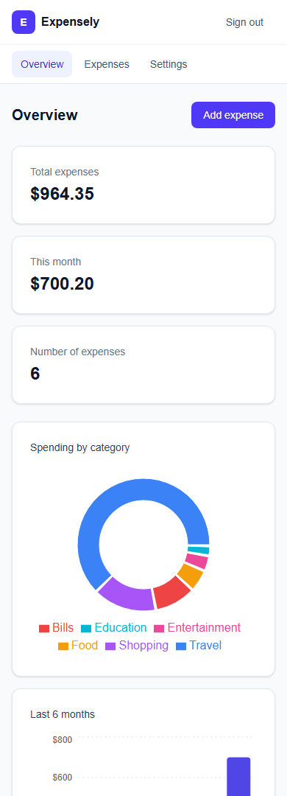

<div align="center">

# Expensely

**A multi-user expense management platform.**

Next.js · TypeScript · Prisma · Auth.js


</div>

Every user registers their own account and can only ever see and manage their own expenses — authorization is enforced **server-side** on every read, write, update, and delete, not just hidden in the UI.

<p align="center">
  
</p>

## Features

- **Authentication** — register, login, logout, protected dashboard, and change password. Sessions are JWT-based via Auth.js (NextAuth v5); passwords are hashed with bcrypt.
- **Expense management** — create, edit, delete, and view expenses with amount, date, description, and category (Food, Travel, Bills, Shopping, Entertainment, Health, Education, Other).
- **Dashboard** — total expenses, spending for the current month, expense count, a spending-by-category chart, and a 6-month spending trend chart.
- **Search & filtering** — search by description, filter by category and date range, sort by date or amount, paginated results.
- **Authorization** — every expense query, update, and delete is scoped to the signed-in user's ID at the database layer, so one user can never read or modify another user's data — even by guessing an expense ID.

<p align="center">
  
</p>

## Tech stack

| Concern | Choice |
|---|---|
| Framework | Next.js 16 (App Router, Server Actions) |
| Language | TypeScript |
| Database | SQLite (zero-config for local review — see note below) |
| ORM | Prisma |
| Auth | Auth.js (NextAuth v5) — Credentials provider, JWT sessions |
| Validation | Zod (server-side, in every Server Action) |
| Styling | Tailwind CSS |
| Charts | Recharts |

> **Why SQLite?** It keeps setup to `npm install` + one Prisma command, with no database server to install or configure. The schema uses no SQLite-specific features, so switching to Postgres for production is just changing the `datasource` provider in [prisma/schema.prisma](prisma/schema.prisma) and the `DATABASE_URL`.

## Getting started

### Prerequisites

- Node.js 18.18+ (Node 20+ recommended)
- npm

### Setup

```bash
git clone <this-repo-url>
cd expense-management-platform
npm install
cp .env.example .env
```

Generate a session secret and paste it into `.env` as `AUTH_SECRET`:

```bash
node -e "console.log(require('crypto').randomBytes(32).toString('base64'))"
```

Create the database and run migrations:

```bash
npx prisma migrate dev
```

Run the app:

```bash
npm run dev
```

Open [http://localhost:3000](http://localhost:3000), register an account, and start adding expenses.

### Other useful commands

```bash
npm run build       # production build
npm run start        # run the production build
npm run lint         # ESLint
npx prisma studio    # browse the local database in a GUI
```

<p align="center">
  
</p>

## Project structure

```
src/
  app/
    (auth)/login, (auth)/register   # public auth pages
    dashboard/                      # protected: overview, expenses, settings
    api/auth/[...nextauth]/         # Auth.js route handler
  actions/                          # Server Actions (auth.ts, expenses.ts) —
                                     # every mutation validates input with Zod
                                     # and scopes the query to the current user
  components/                       # ui/, auth/, expenses/, dashboard/, layout/
  lib/                              # prisma client, zod schemas, constants, utils
  auth.ts / auth.config.ts          # Auth.js config (split so the edge-safe
                                     # part can run in proxy.ts without
                                     # bundling Prisma/bcrypt)
  proxy.ts                          # route protection (redirects unauthenticated
                                     # users away from /dashboard)
prisma/
  schema.prisma                     # User, Expense models
```

## Security notes

- Passwords are hashed with bcrypt (cost factor 12) — plaintext passwords are never stored.
- Every Server Action re-derives the current user from the server-side session (`auth()`); it never trusts a client-supplied user ID.
- Expense reads use a `WHERE userId = <session user>` clause; updates and deletes use `updateMany`/`deleteMany` with the same clause, so a request for an expense ID belonging to another user silently matches zero rows instead of leaking or mutating it.
- Route protection is enforced in `proxy.ts` (server-side) in addition to page-level checks, so it can't be bypassed by disabling JavaScript.
